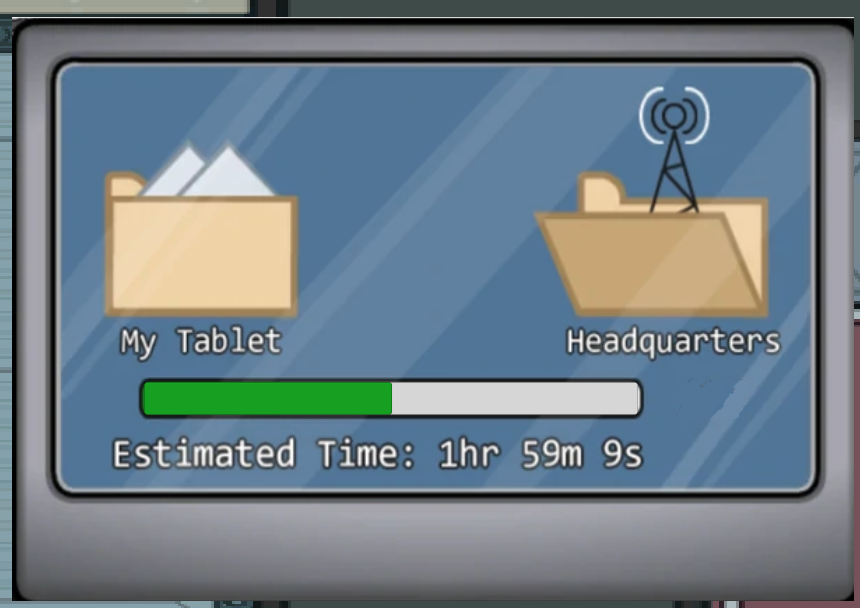

# Требования к проекту
---
 
# Содержание
1 [Введение](#intro)  
1.1 [Назначение](#appointment)  
1.2 [Бизнес-требования](#business_requirements)  
1.2.1 [Исходные данные](#initial_data)  
1.2.2 [Возможности бизнеса](#business_opportunities)  
1.2.3 [Границы проекта](#project_boundary)  
1.3 [Аналоги](#analogues)  
2 [Требования пользователя](#user_requirements)  
2.1 [Программные интерфейсы](#software_interfaces)  
2.2 [Интерфейс пользователя](#user_interface)  
2.3 [Характеристики пользователей](#user_specifications)  
2.3.1 [Классы пользователей](#user_classes)  
2.3.2 [Аудитория приложения](#application_audience)  
2.3.2.1 [Целевая аудитория](#target_audience)  
2.3.2.1 [Побочная аудитория](#collateral_audience)  
2.4 [Предположения и зависимости](#assumptions_and_dependencies)  
3 [Системные требования](#system_requirements)  
3.1 [Функциональные требования](#functional_requirements)  
3.1.1 [Основные функции](#main_functions)  
3.1.1.1 [Вход пользователя в игру](#user_logon_to_the_application)  
3.1.1.2 [Взаимодействие с игрой](#interaction_with_application)      
3.1.1.3 [Взаимодействие с второстепенной задачей](#interaction_with_secondary_task)    
3.1.1.4 [Загрузка данных о проекте](#download_project)    
3.1.1.5 [Выход пользователя из учётной записи](#active_user_change)  
3.1.1.6 [Регистрация нового пользователя после входа в игру](#add_new_user)  
3.1.2 [Ограничения и исключения](#restrictions_and_exclusions)  
3.2 [Нефункциональные требования](#non-functional_requirements)  
3.2.1 [Атрибуты качества](#quality_attributes)  
3.2.1.1 [Требования к удобству использования](#requirements_for_ease_of_use)  
3.2.1.2 [Требования к безопасности](#security_requirements)  
3.2.2 [Внешние интерфейсы](#external_interfaces)  
3.2.3 [Ограничения](#restrictions)  
 
<a name="intro"/>
 
# 1 Введение
 
<a name="appointment"/>
 
## 1.1 Назначение
В этом документе описаны функциональные и нефункциональные требования к Desktop multiplayer игры «Amogus». Этот документ предназначен для команды, которая будет реализовывать и проверять корректность работы игры. 
 
<a name="business_requirements"/>
 
## 1.2 Бизнес-требования
 
<a name="initial_data"/>
 
### 1.2.1 Исходные данные

Многие люди собираются вместе в определенном месте в в определенное время для совместной игры. Однако такой способ не очень эффективен, так как надо найти место проведения, и не у всех получается в определенное время приехать к месту проведения. В связи с этим многие люди используют компьютер для игры с людьми посредством сети Интернет. Большинство используют групповые чаты, которые помогают поддерживать связь между людьми. 

<a name="business_opportunities"/>
 
### 1.2.2 Возможности бизнеса
Многие люди желают иметь игру, которое позволит не выходя из дома играть со своими друзьями или со случайными игроками. Подобная игра позволит не тратить время и силы на организацию встречи. Интерфейс, спроектированный с учётом всех нужных функций для получения необходимого результата, также приятный внешне и, имеющий возможность адаптироваться под каждого пользователя, позволит увеличить количество клиентов.
 
<a name="project_boundary"/>
 
### 1.2.3 Границы проекта
Desktop multiplayer игра "Amogus" позволяет людям играть с друзьями не выходя из дома.
 
<a name="analogues"/>
 
## 1.3 Аналоги
Обзор аналогов представлен в документе [analogues](./analogues.md).
 
<a name="user_requirements"/>
 
# 2 Требования пользователя
 
<a name="software_interfaces"/>
 
## 2.1 Программные интерфейсы
Данные об участниках команды будут браться из баз данных на сервере.
 
<a name="user_interface"/>
 
## 2.2 Интерфейс пользователя
Окно входа в игру.  
  
Окно старта игры.  
  
Главное игровое поле.  
  
Игровое поле после выбора одной из задач во время проведения игры.
  
Окно второстепенной игры во время проведения основной игры.

Окно второй второстепенной игры во время проведения основной игры.

 
<a name="user_specifications"/>
 
## 2.3 Характеристики пользователей
 
<a name="user_classes"/>
 
### 2.3.1 Классы пользователей
 
| Класс пользователей | Описание |
|:---|:---|
| Зарегистрированные пользователи | Пользователи, которые вошли в игру под своим именем (псевдонимом), являющиеся участником команды работающей над определенным проектом. Имеют доступ к полному функционалу. |
 
<a name="application_audience"/>
 
### 2.3.2 Аудитория приложения
 
<a name="target_audience"/>
 
#### 2.3.2.1 Целевая аудитория
Люди любых возрастов, имеющие подключение к Интернету и умеющие пользоваться персональным компьютером, и желающие провести время с друзьями.

<a name="collateral_audience"/>
 
#### 2.3.2.2 Побочная аудитория
Люди любых возрастов, имеющие подключение к Интернету, но не имеющих друзей, но хотят приобрести новые знакомства с помощью игры.
 
<a name="assumptions_and_dependencies"/>
 
## 2.4 Предположения и зависимости
Игра не работает при отсутствии подключения к Интернету.
 
<a name="system_requirements"/>
 
# 3 Системные требования
 
<a name="functional_requirements"/>
 
## 3.1 Функциональные требования
 
<a name="main_functions"/>
 
### 3.1.1 Основные функции
 
<a name="user_logon_to_the_application"/>
 
#### 3.1.1.1 Вход пользователя в игру
**Описание.** Пользователь имеет возможность использовать игру войдя в свою учётную запись.
 
| Функция | Требования | 
|:---|:---|
| Вход в игру без создания собственного профиля | Игра должно попросить пользователя зарегистрироваться, либо войти в уже существующий аккаунт. |
| <a name="registration_requirements"/>Регистрация нового пользователя | Игра должно запросить у пользователя ввести адрес электронной почты и пароль, а также его подтвердить, для создания учётной записи. Пользователь должен либо ввести данные, либо отменить действие. |
| *Пользователь с таким адресом существует* | *Игра должно известить пользователя об ошибке регистрации и запросить ввод другого адреса электронной почты. Пользователь должен либо ввести данные, либо отменить действие.* |
| *Недопустимый пароль* | *Игра должно известить пользователя об ошибке регистрации и запросить ввод другого пароля. Пользователь должен либо ввести данные, либо отменить действие.* |
| Вход зарегистрированного пользователя в игру | Игра направляет на главную страницу. |
 
<a name="interaction_with_application"/>
 
#### 3.1.1.2 Взаимодействие с игрой
**Описание.** Зарегистрированный пользователь имеет возможность передвигаться, запускать второстепенные игры, взаимодействовать с другими игроками.
 
| Функция | Требования | 
|:---|:---|
| Передвижение | Игра должна предоставить зарегистрированному пользователю передвигаться по игровому полю.|
| Запуск второстепенной задачи | Игра должна предоставить зарегистрированному пользователю поле для активации второстепенной задачи. Игрок может запустить или отменить ее запуск.|
| Взаимодействие с другими игроками | Зарегистрированный пользователь имеет возможность взаимодействовать с другими игроками.|

<a name="interaction_with_secondary_task"/>
 
#### 3.1.1.3 Взаимодействие с второстепенной задачей
**Описание.** Зарегистрированный пользователь имеет возможность начать локально второстепенную задачу, за которую он получит очки.

| Функция | Требования | 
|:---|:---|
| Начать второстепенной игры | Основная игра должно предоставить зарегистрированному пользователю поле для начала второстепенной задачи. |
| Пройти второстепенную задачу | Зарегистрированный пользователь имеет возможность пройти второстепенную игру. |
| Отмена второстепенной игры | игра должно предоставить зарегистрированному пользователю  |
| Получить награду за прохождение второстепенной задачи | После прохождения второстепенной задачи игрок должен получить очки, который в будущем сможет обменять на какие-то плюшки. |

<a name="download_project"/>
 
#### 3.1.1.4 Загрузка данных о проекте
**Описание.** После входа пользователя в игру необходимо загрузить все данные об участниках команды и о прогрессе разработки проекта.
 
| Функция | Требования | 
|:---|:---|
| Загрузка информации о проекте | Игра должно загрузить информацию о проекте из базы данных после входа пользователя в игру. |
| Загрузка информации об участниках команды | Игра должно загрузить информацию об участниках команды из базы данных после входа пользователя в игру. |
 
<a name="active_user_change"/>
 
#### 3.1.1.5 Выход зарегистрированного пользователя из учётной записи
**Описание.** Зарегистрированный пользователь имеет возможность выйти из учётной записи.
 
**Требование.** Игра должно предоставить зарегистрированному пользователю возможность выйти из учётной записи с возвратом к окну входа в игру.
 
<a name="add_new_user"/>
 
#### 3.1.1.6 Регистрация нового пользователя после входа в игру
**Описание.** Анонимный пользователь имеет возможность зарегистрироваться в игре.
 
**Требование.** Игра должно предоставить анонимному пользователю возможность зарегистрироваться в игре.
 
<a name="restrictions_and_exclusions"/>
 
### 3.1.2 Ограничения и исключения
1. Игра работает только при наличии подключения к Интернету;
2. Игра может работать некорректно на старых персональных компьютерах ил ноутбуках, не поддерживающих некоторые функции.
 
<a name="non-functional_requirements"/>
 
## 3.2 Нефункциональные требования
 
<a name="quality_attributes"/>
 
### 3.2.1 Атрибуты качества
 
<a name="requirements_for_ease_of_use"/>
 
#### 3.2.1.1 Требования к удобству использования
1. Функциональные элементы не перегружают экран.
2. Все функциональные элементы пользовательского интерфейса имеют названия, описывающие действие, которое произойдет при выборе элемента.
3. Интерфейс интуитивно понятный и простой.

<a name="security_requirements"/>
 
#### 3.2.1.2 Требования к безопасности
Игра предоставляет возможность просмотр и редактирование своего аккаунта только для зарегистрированного пользователя.
 
<a name="external_interfaces"/>
 
### 3.2.2 Внешние интерфейсы
Окна игры удобны для использования пользователями с плохим зрением:
  * функциональные элементы контрастны фону окна.
  * функциональные элементы линейно распределены по экрану.
 
<a name="restrictions"/>
 
### 3.2.3 Ограничения
1. Игра реализовано с помощью игрового движка Unity 2020.3.38 и C# 11.
2. Профили участников команды и стадии выполнения задачи хранятся в базе данных для продолжительной работы.